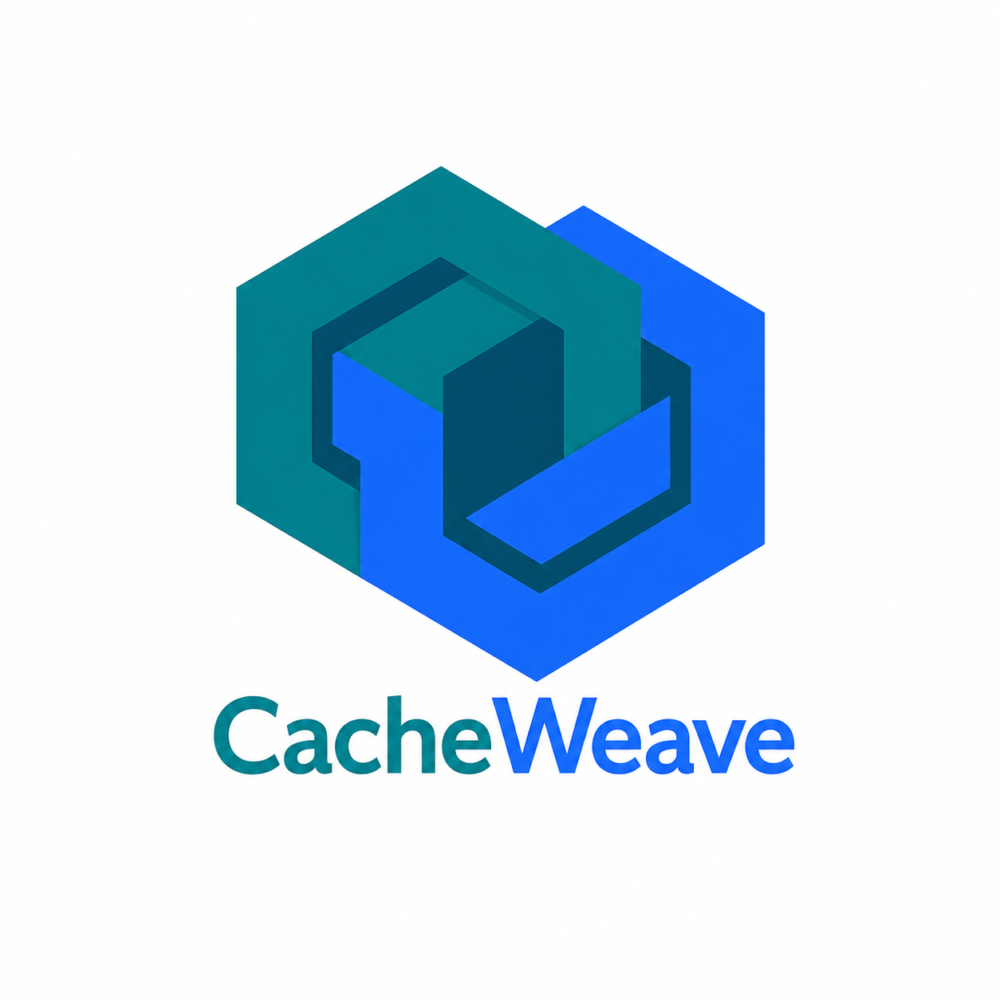

<p align="center">
  
</p>

<p align="center">
  <a href="https://github.com/teghoz/CacheWeave/actions/workflows/ci.yml">
    
  </a>
</p>

# CacheWeave

Provider-agnostic, declarative response caching for ASP.NET Core.

Decorate any controller action, Razor Page handler, or Minimal API endpoint with `[CacheWeave]` and responses are cached automatically — no boilerplate, no manual cache key management, no stampede risk.

```csharp
[HttpGet]
[CacheWeave("products", ExpirySeconds = 300)]
public async Task<IActionResult> GetProducts([FromQuery] int page = 1)
    => Ok(await _mediator.Send(new GetProductsQuery { Page = page }));
```

---

## Features

| Feature | Detail |
|---|---|
| **Attribute-based caching** | `[CacheWeave]` on any MVC action, Razor Page, or Minimal API endpoint |
| **Automatic key derivation** | Omit the key and CacheWeave derives it from `ControllerName.ActionName` via reflection |
| **Eviction** | `[CacheWeaveEvict]` by exact key or prefix, post-action, with multi-attribute support |
| **Stampede protection** | Per-key `SemaphoreSlim` by default; swap for a distributed lock in multi-instance deployments |
| **Conditional caching** | `NoCacheWhen` flags — skip caching on errors, empty results, or both |
| **Sliding expiry** | Emulated by re-writing the entry on every cache hit |
| **Route parameters** | Route values (e.g. `{id}`) are automatically included in cache keys — framework keys (`controller`, `action`, `page`, `area`) are excluded |
| **Body hashing** | SHA-256 hash of the request body (or selected fields) appended to the key for POST endpoints |
| **Compression** | Optional GZip compression before storage — transparent to callers |
| **Serializer choice** | System.Text.Json (default) or Newtonsoft.Json, configured globally |
| **OpenTelemetry** | Hit/miss/set/eviction counters + duration histogram + Activity spans, all opt-in |
| **Configurable logging** | Diagnostic log level set globally — surface cache activity at `Information` in production |
| **Programmatic API** | `ICacheWeaveService` for `GetOrSetAsync`, `SetAsync`, `InvalidateAsync` |
| **Fault-tolerant** | All cache I/O wrapped in try/catch — Redis outage degrades to cache-miss behaviour, never a 500 |
| **7 providers** | Redis, InMemory, SQLite, NCache, DynamoDB, Memcached, FASTER KV |
| **Multi-target** | `net8.0`, `net9.0`, `net10.0` |

---

## Quick Start

### 1. Install

```bash
dotnet add package CacheWeave.Core
dotnet add package CacheWeave.Redis   # or CacheWeave.InMemory, etc.
```

### 2. Register

```csharp
// Program.cs
builder.Services.AddCacheWeave(options =>
{
    options.Serializer         = CacheWeaveSerializerType.SystemTextJson; // default
    options.GlobalKeyPrefix    = "my-app";   // e.g. "my-app:products:list"
    options.KeyVersion         = "v1";
    options.DefaultExpiry      = TimeSpan.FromMinutes(5);
    options.EnableMetrics      = true;
    options.DiagnosticLogLevel = LogLevel.Debug;
    options.EnableCompression  = false;
});

builder.Services.AddCacheWeaveRedis("localhost:6379");
// or: builder.Services.AddCacheWeaveInMemory();

// Wire [CacheWeave] and [CacheWeaveEvict] attributes into the MVC pipeline
builder.Services.AddControllers().AddCacheWeaveFilters();
```

### 3. Decorate

```csharp
// Explicit key
[HttpGet]
[CacheWeave("products:list", ExpirySeconds = 300, IncludeQueryParams = true)]
public Task<IActionResult> GetAll([FromQuery] int page = 1) { ... }

// Derived key — resolves to "Products.GetAll" automatically
[HttpGet]
[CacheWeave]
public Task<IActionResult> GetAll() { ... }

// Route parameters — {id} is automatically included in the cache key
// GET /products/42 → key: "products:id=42"
[HttpGet("{id}")]
[CacheWeave("products")]
public Task<IActionResult> GetById(int id) { ... }

// Route params + query params combined
// GET /products/42/reviews?page=2 → key: "products:reviews:id=42:page=2"
[HttpGet("{id}/reviews")]
[CacheWeave("products:reviews")]
public Task<IActionResult> GetReviews(int id, [FromQuery] int page = 1) { ... }

// Exclude specific route params from the key
[HttpGet("{id}/{version}")]
[CacheWeave("products", ExcludeRouteParams = ["version"])]
public Task<IActionResult> GetById(int id, string version) { ... }

// Disable route params entirely
[HttpGet("{id}")]
[CacheWeave("products", IncludeRouteParams = false)]
public Task<IActionResult> GetById(int id) { ... }

// Minimal API with route parameters
app.MapGet("/products/{id}", (int id) => ...)
   .WithCacheWeave("products");

// Minimal API — exclude specific route params
app.MapGet("/products/{id}/{version}", (int id, string version) => ...)
   .WithCacheWeave("products", excludeRouteParams: ["version"]);

// Evict on mutation
[HttpPost]
[CacheWeaveEvict(Prefix = "products:")]
public Task<IActionResult> Create([FromBody] CreateProductCommand cmd) { ... }
```

---

## Configuration Reference

All options are set via `AddCacheWeave(options => ...)`:

| Property | Type | Default | Description |
|---|---|---|---|
| `KeySeparator` | `string` | `":"` | Separator between key segments |
| `GlobalKeyPrefix` | `string?` | `null` | Prepended to every key — use to namespace keys when multiple apps share one Redis |
| `KeyVersion` | `string?` | `null` | Global version injected after the base key |
| `DefaultExpiry` | `TimeSpan?` | `5 min` | TTL when not set on the attribute |
| `DefaultNoCacheCondition` | `NoCacheCondition` | `OnErrorOrEmpty` | Global skip-cache rule |
| `Serializer` | `CacheWeaveSerializerType` | `SystemTextJson` | `SystemTextJson` or `NewtonsoftJson` |
| `EnableCompression` | `bool` | `false` | GZip compress values before storage |
| `EnableMetrics` | `bool` | `true` | Emit OTel metrics and Activity spans |
| `DiagnosticLogLevel` | `LogLevel` | `Debug` | Log level for internal diagnostics |

---

## Attribute Reference

### `[CacheWeave]`

| Property | Type | Default | Description |
|---|---|---|---|
| `Key` (ctor) | `string?` | `null` | Base key. Omit to derive from controller/action name |
| `ExpirySeconds` | `int` | `-1` (global) | TTL. `0` = no expiry |
| `IncludeRouteParams` | `bool` | `true` | Append sorted route params (path segments) to key |
| `ExcludeRouteParams` | `string[]` | `[]` | Route params to strip from key |
| `IncludeQueryParams` | `bool` | `true` | Append sorted query params to key |
| `ExcludeParams` | `string[]` | `[]` | Query params to strip from key |
| `HashBody` | `bool` | `false` | Append SHA-256 body hash to key |
| `HashBodyFields` | `string[]` | `[]` | Hash only these fields (empty = entire body) |
| `SlidingExpiry` | `bool` | `false` | Reset TTL on every cache hit |
| `NoCacheWhen` | `NoCacheCondition` | `OnErrorOrEmpty` | Skip caching condition |

### `[CacheWeaveEvict]`

| Property | Type | Default | Description |
|---|---|---|---|
| `Key` | `string?` | `null` | Exact key to evict |
| `Prefix` | `string?` | `null` | Evict all keys with this prefix |
| `EvictOnFailure` | `bool` | `false` | Evict even when the action fails |

Multiple `[CacheWeaveEvict]` attributes are allowed on a single action.

---

## Providers

| Package | Backing store | `RemoveByPrefix` |
|---|---|---|
| `CacheWeave.Redis` | StackExchange.Redis | Yes (SCAN + DEL) |
| `CacheWeave.InMemory` | `IMemoryCache` | Yes (prefix scan) |
| `CacheWeave.SQLite` | Microsoft.Data.Sqlite | Yes (SQL LIKE) |
| `CacheWeave.NCache` | Alachisoft NCache | No |
| `CacheWeave.DynamoDB` | AWS DynamoDB | No |
| `CacheWeave.Memcached` | EnyimMemcachedCore | No |
| `CacheWeave.Faster` | Microsoft FASTER KV | No |

---

## OpenTelemetry

```csharp
builder.Services.AddOpenTelemetry()
    .WithMetrics(b => b.AddCacheWeaveMeter())
    .WithTracing(b => b.AddCacheWeaveInstrumentation());
```

Metrics emitted:

| Metric | Type | Description |
|---|---|---|
| `cacheweave.hits` | Counter | Cache hits |
| `cacheweave.misses` | Counter | Cache misses |
| `cacheweave.sets` | Counter | Cache writes |
| `cacheweave.evictions` | Counter | Explicit evictions |
| `cacheweave.duration` | Histogram (ms) | Time to resolve a cache operation |

All instruments carry `cache.key` (or `cache.prefix`) tags.

---

## Programmatic API

```csharp
public class ProductService(ICacheWeaveService cache)
{
    public Task<Product?> GetAsync(Guid id) =>
        cache.GetOrSetAsync(
            $"products:{id}",
            ct => _repo.FindAsync(id, ct),
            expiry: TimeSpan.FromMinutes(10));

    public Task InvalidateAsync(Guid id) =>
        cache.InvalidateAsync($"products:{id}");
}
```

---

## License

GPL-3.0 — see [LICENSE](LICENSE).
